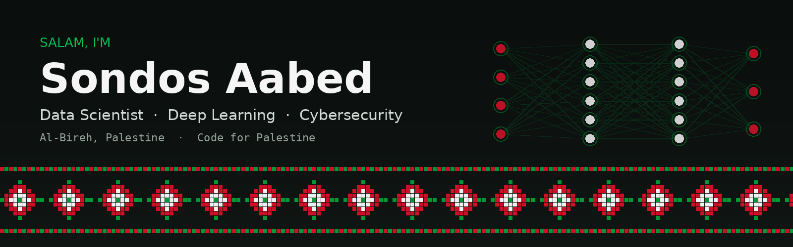

 

---

## ☮ Salam! I'm Sondos

I'm an **inquisitive epistemophile** who loves tech, art and philosophy. I studied **Computer Science at Birzeit University** and I work at the meeting point of **deep learning, data science and cybersecurity**, with a soft spot for problems that matter to people at home in Palestine.

- 🧠 **Deep learning & computer vision:** biometrics, handwriting recognition, image classification
- 📊 **Data science & data quality:** analysis, modeling, and making messy data trustworthy
- 🛡️ **Cybersecurity-minded:** authentication, digital forensics, security-first thinking
- 📱 **From notebook to product:** I like taking a model all the way to a working mobile or web app
- 🇵🇸 **Tech for Palestine:** hackathons, open-source and data-for-good work with Palestinian tech communities
- 🌱 **Always learning:** currently building my knowledge base, one track and one project at a time

> *"Imagination is more important than knowledge."*

---

## 🚀 Featured work

### 👁️ [Iris Recognition: end-to-end, segmentation-free biometric authentication](https://github.com/sondosaabed/Iris-of-eyes-recognition)

A CNN that identifies **2,000 iris identities** (1,000 subjects × left/right eye) straight from lightly preprocessed eye images, with **no iris segmentation step**. It reaches **92.5% test accuracy** on CASIA-Iris-Thousand and is deployed to an **Android app** as TensorFlow Lite, with authentication (camera) and enrollment flows.

`TensorFlow` `Keras` `OpenCV` `TFLite` `Android` `Biometrics`

[📓 Code](https://github.com/sondosaabed/Iris-of-eyes-recognition) · [🏆 Kaggle notebook](https://www.kaggle.com/code/sondosaabed/iris-eye-recognition-endtoend-93) · [📱 Android app](https://github.com/sondosaabed/IrisRecognizer)

 

### ✍️ [KhattTech: Arabic handwriting recognition on your phone](https://github.com/KhattTech/.github) · *graduation project*

A mobile app with an **Intelligent Character Recognition (ICR)** system that reads **Arabic handwriting** and returns the text as a document you can share, download and rename. The model side is an end-to-end, segmentation-free approach evaluated on the **KHATT** dataset, with a paper on ResearchGate.

`Deep Learning` `Arabic OCR` `Mobile` `ICR`

[📱 KhattTech](https://github.com/KhattTech) · [📄 Paper](https://www.researchgate.net/publication/381429976_An_End-to-End_Segmentation-Free_Arabic_Handwritten_Recognition_Model_on_KHATT)

 

### 🎓 [PalTaqdeer: AI-driven student success forecaster](https://github.com/sondosaabed/PalTaqdeer) · *Google Launchpad Hackathon 2023*

Predicts student success with a **linear regression** model behind a **Flask** web app, built on data analysis with outlier detection. Built during the Google Launchpad hackathon with a mentor's guidance.

`Python` `pandas` `matplotlib` `Linear Regression` `Flask` `Hackathon`

 

### 🕊️ [ROMP: Recovery of Missing People](https://github.com/ROMP-Recovery-Of-Missing-People/ROMP) · *AI competition*

An app that **connects relatives with their missing loved ones** to ease the search, built for an AI competition.

 

<b>📂 More projects (click to expand)</b>

 

| Project | What it is | Stack |
|---|---|---|
| [Predicting Diabetes with Decision Trees](https://github.com/sondosaabed/Predicting-Diabetes-with-Decision-Trees) | Decision-tree model for diabetes prediction with a desktop GUI | Java, WEKA, JavaFX, Maven |
| [NICS Firearm Background Checks](https://github.com/sondosaabed/NICS-firearm-background-checks-investigation) | Data investigation of the FBI's National Instant Criminal Background Check System | Data analysis |
| [Weather Dataset Analysis](https://github.com/sondosaabed/Weather-Dataset-Analysis) | Data analysis and modeling on a weather dataset | Data analysis |
| [Customer Churn Dataset Analysis](https://github.com/sondosaabed/Customer-Churn-Dataset-Analysis) | Data analysis and modeling on customer churn | Data analysis |
| [Taskaty](https://github.com/sondosaabed/Taskaty) | Task-management mobile app | Java, mobile |
| [Palestine Cities Map](https://github.com/sondosaabed/Palestine-Cities-Map) | Map and graph project over Palestinian cities | Java |
| [PalTales](https://github.com/sondosaabed/PalTales) | See the repo for details | - |

---

## 🧰 Tech stack

**AI / Data**

**Apps & backend**

**Tools**

**Exposure:** Selenium · JUnit · PHP · Laravel

---

## 🎓 Education & scholarships

| When | What |
|---|---|
| **2019 – 2024** | 🏛️ **B.Sc. Computer Science, Birzeit University**: machine learning, AI, databases, digital forensics, Linux, software testing & engineering, web development, data structures |
| **Dec 2023 – Feb 2024** | 🤖 **Udacity, AI Programming with Python** (Bertelsmann scholarship, one of 50,000 accepted) |
| **Nov 2023** | 📚 **DataCamp**: 3 career tracks (incl. Deep Learning and Image Processing), 14 courses, 34 hours |
| **May – Sep 2023** | 📈 **Udacity, Data Science** (Google scholarship): SQL, Python, version control, plus an AI hackathon (PalTaqdeer) |
| **2015 – 2018** | 🗣️ **AMIDEAST English Access Microscholarship**: public speaking, leadership, community service |

---

## 🤝 Communities I build with

<b>🌍 Volunteering & community work</b>

 

| Year | Where | What I did |
|---|---|---|
| 2021 | **Sharek Youth Forum** | *Initiative leader*: led an election-awareness campaign in Al-Bireh encouraging youth participation, especially young women and people with disabilities |
| 2020 | **Al-Bireh Cultural Club** | *Planner*: helped plan a post-COVID child-labor advocacy initiative in Ramallah |
| 2019 | **Al-Bireh Sons Charity Association** | *Volunteer*: organized activities for Down syndrome patients at the Palestinian International Book Fair |
| 2018 | **Al-Haqal o Al-Baydar** | *Volunteer* at a children's summer camp |
| 2015 – 2017 | **Hakawati** | *Volunteer*: helped plan cultural and community events in Al-Bireh |

---

## 📊 GitHub at a glance

---

## 🎨 Beyond code

I draw and I read. You can find my sketches on [Behance](https://www.behance.net/sondosaabed) and my bookshelf on [Goodreads](https://www.goodreads.com/sondos_aabed). Art and philosophy shape how I think about technology and who it should serve.

---

## 📬 Let's connect

I'm always happy to talk **deep learning, biometrics, Arabic OCR, data-for-good, or tech in Palestine**, whether it's collaboration, feedback on a project, or just a chat.

*Made in Al-Bireh, Palestine 🇵🇸*

